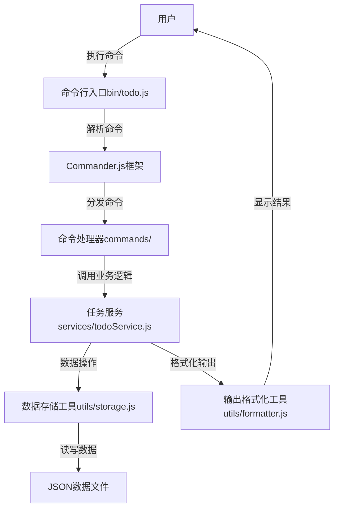
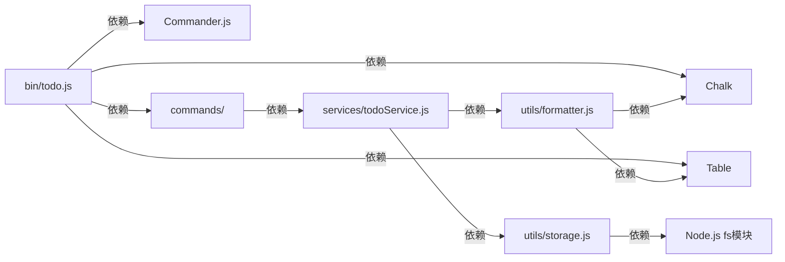
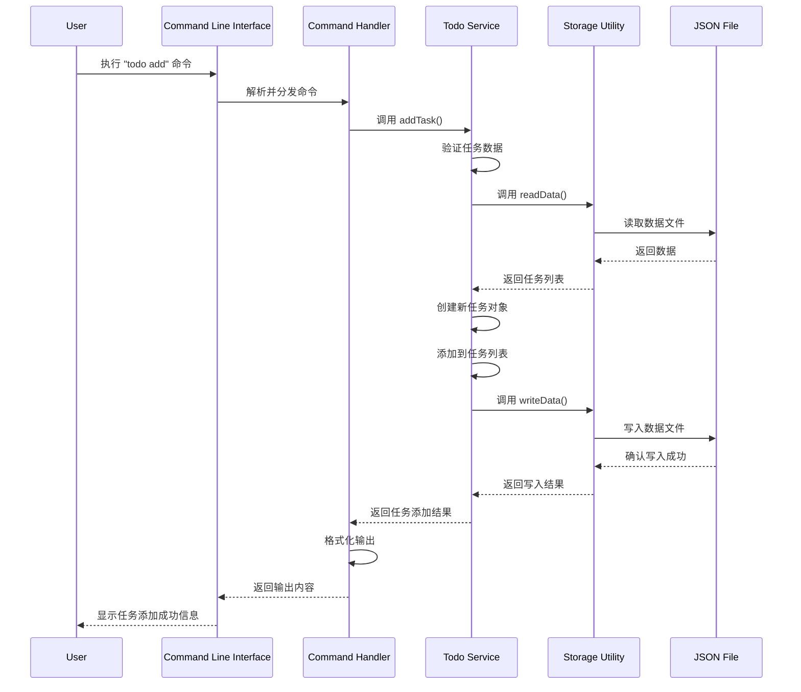
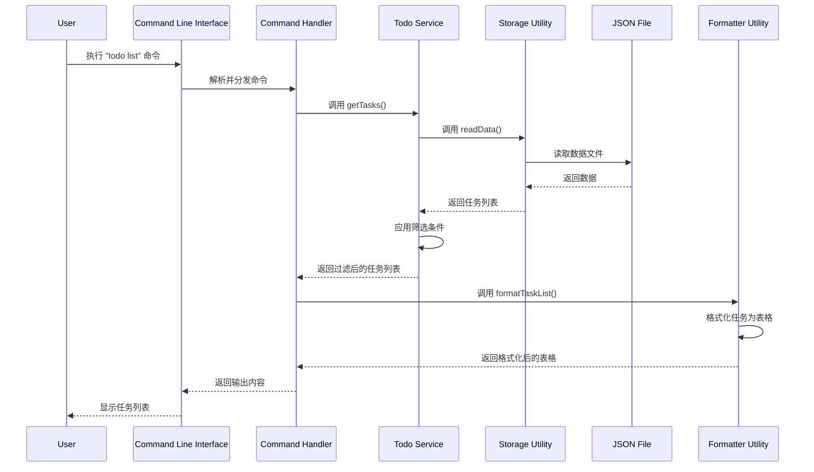
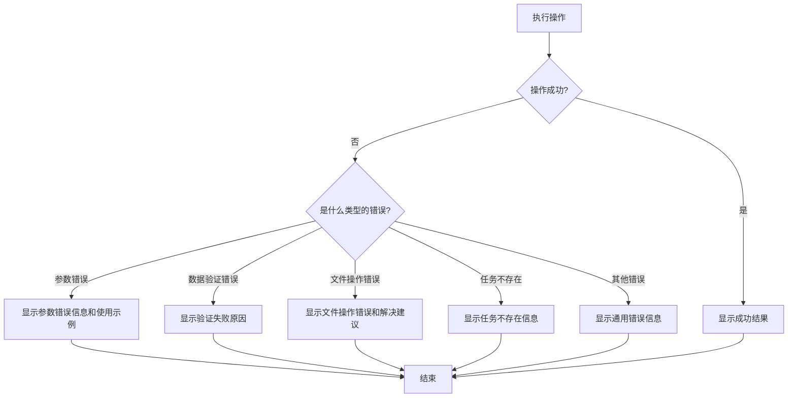

# 每日TODO List CLI工具 - 设计文档

## 1. 整体架构图



## 2. 分层设计和核心组件

### 2.1 分层架构

| 层级 | 职责 | 组件 |
|------|------|------|
| **表示层** | 命令行接口和用户交互 | bin/todo.js, Commander.js |
| **控制层** | 命令解析和分发 | commands/目录下的各命令处理器 |
| **业务逻辑层** | 任务管理核心逻辑 | services/todoService.js |
| **数据访问层** | 数据持久化 | utils/storage.js |
| **工具层** | 辅助功能 | utils/formatter.js |

### 2.2 核心组件

#### 2.2.1 命令行入口 (bin/todo.js)
- **功能**：程序入口点，配置和初始化CLI应用
- **职责**：
  - 设置命令行应用名称和版本
  - 注册所有子命令
  - 处理全局选项
  - 启动应用程序

#### 2.2.2 命令处理器 (commands/)
- **功能**：实现具体的命令逻辑
- **组件**：
  - `add.js`：添加任务命令
  - `list.js`：查看任务命令
  - `done.js`：标记完成命令
  - `update.js`：更新任务命令
  - `delete.js`：删除任务命令
  - `stats.js`：任务统计命令
- **职责**：
  - 解析命令参数
  - 调用任务服务执行业务逻辑
  - 处理命令结果和错误
  - 格式化输出给用户

#### 2.2.3 任务服务 (services/todoService.js)
- **功能**：实现任务管理的核心业务逻辑
- **职责**：
  - 任务的增删改查操作
  - 任务状态管理
  - 优先级处理
  - 日期相关计算
  - 数据验证

#### 2.2.4 数据存储工具 (utils/storage.js)
- **功能**：负责数据的持久化存储
- **职责**：
  - 读取JSON数据文件
  - 写入JSON数据文件
  - 数据文件初始化
  - 防止数据损坏

#### 2.2.5 输出格式化工具 (utils/formatter.js)
- **功能**：格式化输出结果，提升用户体验
- **职责**：
  - 彩色文本输出
  - 表格格式化
  - 日期格式化
  - 优先级颜色标记

## 3. 模块依赖关系图



## 4. 接口契约定义

### 4.1 命令行接口

#### 4.1.1 添加任务命令
```javascript
// 接口定义
todo add -t <title> -d <description> -p <priority> -dd <dueDate>

// 参数说明
-t, --title: 任务标题 (必填)
-d, --description: 任务描述 (可选)
-p, --priority: 优先级 (可选，默认: medium)
-dd, --dueDate: 截止日期 (可选，格式: YYYY-MM-DD)

// 返回结果
成功: 显示"任务添加成功!"和任务详情
失败: 显示错误信息
```

#### 4.1.2 查看任务命令
```javascript
// 接口定义
todo list -a -d <date> -p <priority>

// 参数说明
-a, --all: 查看所有任务 (可选)
-d, --date: 查看特定日期任务 (可选，格式: YYYY-MM-DD)
-p, --priority: 按优先级筛选 (可选)

// 返回结果
成功: 以表格形式显示任务列表
失败: 显示错误信息
```

#### 4.1.3 标记完成命令
```javascript
// 接口定义
todo done <id>

// 参数说明
<id>: 任务ID (必填)

// 返回结果
成功: 显示"任务已标记为完成!"和任务详情
失败: 显示错误信息
```

#### 4.1.4 更新任务命令
```javascript
// 接口定义
todo update <id> -t <title> -d <description> -p <priority> -dd <dueDate>

// 参数说明
<id>: 任务ID (必填)
-t, --title: 新标题 (可选)
-d, --description: 新描述 (可选)
-p, --priority: 新优先级 (可选)
-dd, --dueDate: 新截止日期 (可选，格式: YYYY-MM-DD)

// 返回结果
成功: 显示"任务更新成功!"和任务详情
失败: 显示错误信息
```

#### 4.1.5 删除任务命令
```javascript
// 接口定义
todo delete <id>

// 参数说明
<id>: 任务ID (必填)

// 返回结果
成功: 显示"任务删除成功!"
失败: 显示错误信息
```

#### 4.1.6 任务统计命令
```javascript
// 接口定义
todo stats

// 参数说明
无

// 返回结果
成功: 显示任务统计信息
失败: 显示错误信息
```

### 4.2 内部服务接口

#### 4.2.1 任务服务接口 (todoService.js)

```javascript
// 添加任务
function addTask(title, description, priority, dueDate) {
  // 参数: title(string), description(string), priority(string), dueDate(string)
  // 返回: { success: boolean, data: Task|null, error: string|null }
}

// 获取任务列表
function getTasks(filter) {
  // 参数: filter(object) - { date: string, priority: string, completed: boolean }
  // 返回: { success: boolean, data: Task[]|null, error: string|null }
}

// 更新任务状态
function toggleTaskStatus(id, completed) {
  // 参数: id(string), completed(boolean)
  // 返回: { success: boolean, data: Task|null, error: string|null }
}

// 更新任务信息
function updateTask(id, updates) {
  // 参数: id(string), updates(object) - { title, description, priority, dueDate }
  // 返回: { success: boolean, data: Task|null, error: string|null }
}

// 删除任务
function deleteTask(id) {
  // 参数: id(string)
  // 返回: { success: boolean, error: string|null }
}

// 获取任务统计
function getTaskStats() {
  // 返回: { success: boolean, data: { total: number, completed: number, pending: number }|null, error: string|null }
}
```

#### 4.2.2 数据存储接口 (storage.js)

```javascript
// 读取数据
function readData() {
  // 返回: { success: boolean, data: object|null, error: string|null }
}

// 写入数据
function writeData(data) {
  // 参数: data(object)
  // 返回: { success: boolean, error: string|null }
}

// 初始化数据文件
function initStorage() {
  // 返回: { success: boolean, error: string|null }
}
```

#### 4.2.3 输出格式化接口 (formatter.js)

```javascript
// 格式化任务列表
function formatTaskList(tasks) {
  // 参数: tasks(Task[])
  // 返回: string (格式化后的表格字符串)
}

// 格式化任务详情
function formatTaskDetail(task) {
  // 参数: task(Task)
  // 返回: string (格式化后的任务详情字符串)
}

// 格式化统计信息
function formatStats(stats) {
  // 参数: stats(object) - { total, completed, pending }
  // 返回: string (格式化后的统计信息字符串)
}

// 格式化日期
function formatDate(dateString) {
  // 参数: dateString(string)
  // 返回: string (格式化后的日期字符串)
}
```

## 5. 数据流向图

### 5.1 添加任务数据流



### 5.2 查看任务数据流



## 6. 异常处理策略

### 6.1 异常类型

| 异常类型 | 描述 | 处理策略 |
|----------|------|----------|
| **参数错误** | 命令参数缺失或格式不正确 | 显示清晰的错误信息和使用示例 |
| **数据验证错误** | 任务数据不符合要求 | 显示具体的验证失败原因 |
| **文件操作错误** | 数据文件读写失败 | 显示文件操作错误信息，建议检查权限 |
| **任务不存在** | 操作的任务ID不存在 | 显示"任务不存在"信息 |
| **未知错误** | 其他未预期的错误 | 显示通用错误信息，并建议报告问题 |

### 6.2 异常处理流程



### 6.3 错误日志

- 记录关键错误信息到日志文件（可选）
- 日志包含时间戳、错误类型、错误消息和堆栈跟踪
- 日志文件路径：`~/.todo-cli/error.log`

## 7. 数据模型定义

### 7.1 任务模型

```javascript
{
  id: string,           // 唯一标识符 (UUID)
  title: string,        // 任务标题
  description: string,  // 任务描述
  priority: string,     // 优先级 (high/medium/low)
  dueDate: string,      // 截止日期 (YYYY-MM-DD)
  completed: boolean,   // 完成状态
  createdAt: string,    // 创建时间 (ISO格式)
  updatedAt: string     // 更新时间 (ISO格式)
}
```

### 7.2 数据文件结构

```javascript
{
  tasks: [
    // 任务对象数组
  ]
}
```

## 8. 配置管理

### 8.1 配置项

| 配置项 | 默认值 | 描述 |
|--------|--------|------|
| `dataFile` | `~/.todo-cli/tasks.json` | 数据文件路径 |
| `backupEnabled` | `false` | 是否启用自动备份 |
| `backupInterval` | `7` | 备份间隔（天） |
| `backupDir` | `~/.todo-cli/backups` | 备份文件目录 |

### 8.2 配置文件结构

```javascript
{
  dataFile: string,
  backupEnabled: boolean,
  backupInterval: number,
  backupDir: string
}
```
