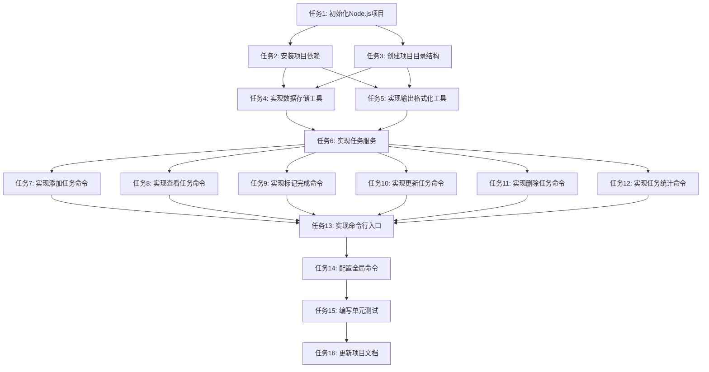

# 每日TODO List CLI工具 - 任务拆分文档

## 1. 原子任务拆分

### 1.1 项目初始化和配置

#### 任务1: 初始化Node.js项目
- **输入契约**：
  - 工作目录：`d:\AI\Trae\test`
  - Node.js环境（>=14.x）
- **输出契约**：
  - 创建`package.json`文件
  - 配置项目基本信息（名称、版本、描述等）
- **实现约束**：
  - 使用npm init命令初始化
  - 项目名称：todo-cli
  - 入口文件：bin/todo.js
- **依赖关系**：
  - 无前置任务
  - 后置任务：任务2、任务3

#### 任务2: 安装项目依赖
- **输入契约**：
  - 已初始化的Node.js项目
- **输出契约**：
  - 安装所需依赖包：commander、chalk、table、uuid
  - 更新`package.json`的dependencies字段
- **实现约束**：
  - 使用npm install命令
  - 依赖版本选择稳定版
- **依赖关系**：
  - 前置任务：任务1
  - 后置任务：所有实现任务

#### 任务3: 创建项目目录结构
- **输入契约**：
  - 已初始化的Node.js项目
- **输出契约**：
  - 创建bin/目录
  - 创建src/commands/目录
  - 创建src/services/目录
  - 创建src/models/目录
  - 创建src/utils/目录
- **实现约束**：
  - 遵循设计文档中的项目结构
- **依赖关系**：
  - 前置任务：任务1
  - 后置任务：所有实现任务

### 1.2 核心工具模块实现

#### 任务4: 实现数据存储工具 (utils/storage.js)
- **输入契约**：
  - 项目目录结构已创建
  - Node.js fs模块
- **输出契约**：
  - 实现readData()函数
  - 实现writeData()函数
  - 实现initStorage()函数
- **实现约束**：
  - 数据文件路径：~/.todo-cli/tasks.json
  - 使用JSON格式存储数据
  - 包含错误处理
- **依赖关系**：
  - 前置任务：任务3
  - 后置任务：任务6

#### 任务5: 实现输出格式化工具 (utils/formatter.js)
- **输入契约**：
  - 项目目录结构已创建
  - 已安装chalk和table依赖
- **输出契约**：
  - 实现formatTaskList()函数
  - 实现formatTaskDetail()函数
  - 实现formatStats()函数
  - 实现formatDate()函数
- **实现约束**：
  - 使用表格形式展示任务列表
  - 使用彩色输出增强可读性
- **依赖关系**：
  - 前置任务：任务2、任务3
  - 后置任务：任务7-12

### 1.3 业务逻辑层实现

#### 任务6: 实现任务服务 (services/todoService.js)
- **输入契约**：
  - 已实现storage.js工具
  - 已安装uuid依赖
- **输出契约**：
  - 实现addTask()函数
  - 实现getTasks()函数
  - 实现toggleTaskStatus()函数
  - 实现updateTask()函数
  - 实现deleteTask()函数
  - 实现getTaskStats()函数
- **实现约束**：
  - 遵循设计文档中的接口定义
  - 包含数据验证逻辑
- **依赖关系**：
  - 前置任务：任务2、任务4
  - 后置任务：任务7-12

### 1.4 命令处理器实现

#### 任务7: 实现添加任务命令 (commands/add.js)
- **输入契约**：
  - 已实现todoService.js
  - 已实现formatter.js
- **输出契约**：
  - 实现add命令的处理逻辑
  - 支持命令行参数解析
  - 显示任务添加结果
- **实现约束**：
  - 使用commander.js的command API
  - 标题参数为必填项
- **依赖关系**：
  - 前置任务：任务5、任务6
  - 后置任务：任务13

#### 任务8: 实现查看任务命令 (commands/list.js)
- **输入契约**：
  - 已实现todoService.js
  - 已实现formatter.js
- **输出契约**：
  - 实现list命令的处理逻辑
  - 支持筛选参数
  - 以表格形式显示任务列表
- **实现约束**：
  - 支持按日期和优先级筛选
  - 默认只显示未完成任务
- **依赖关系**：
  - 前置任务：任务5、任务6
  - 后置任务：任务13

#### 任务9: 实现标记完成命令 (commands/done.js)
- **输入契约**：
  - 已实现todoService.js
  - 已实现formatter.js
- **输出契约**：
  - 实现done命令的处理逻辑
  - 支持标记任务为完成/未完成
  - 显示任务更新结果
- **实现约束**：
  - 任务ID为必填参数
- **依赖关系**：
  - 前置任务：任务5、任务6
  - 后置任务：任务13

#### 任务10: 实现更新任务命令 (commands/update.js)
- **输入契约**：
  - 已实现todoService.js
  - 已实现formatter.js
- **输出契约**：
  - 实现update命令的处理逻辑
  - 支持更新任务的各种属性
  - 显示任务更新结果
- **实现约束**：
  - 任务ID为必填参数
  - 支持部分更新
- **依赖关系**：
  - 前置任务：任务5、任务6
  - 后置任务：任务13

#### 任务11: 实现删除任务命令 (commands/delete.js)
- **输入契约**：
  - 已实现todoService.js
  - 已实现formatter.js
- **输出契约**：
  - 实现delete命令的处理逻辑
  - 支持删除指定任务
  - 显示任务删除结果
- **实现约束**：
  - 任务ID为必填参数
  - 包含确认提示（可选）
- **依赖关系**：
  - 前置任务：任务5、任务6
  - 后置任务：任务13

#### 任务12: 实现任务统计命令 (commands/stats.js)
- **输入契约**：
  - 已实现todoService.js
  - 已实现formatter.js
- **输出契约**：
  - 实现stats命令的处理逻辑
  - 显示任务统计信息
- **实现约束**：
  - 显示总任务数、已完成数、未完成数
- **依赖关系**：
  - 前置任务：任务5、任务6
  - 后置任务：任务13

### 1.5 命令行入口配置

#### 任务13: 实现命令行入口 (bin/todo.js)
- **输入契约**：
  - 所有命令处理器已实现
  - 已安装commander依赖
- **输出契约**：
  - 配置CLI应用
  - 注册所有子命令
  - 实现全局选项
- **实现约束**：
  - 设置正确的shebang
  - 配置package.json的bin字段
- **依赖关系**：
  - 前置任务：任务7-12
  - 后置任务：任务14

#### 任务14: 配置全局命令
- **输入契约**：
  - 已实现bin/todo.js
- **输出契约**：
  - 配置package.json的bin字段
  - 允许通过全局命令todo执行
- **实现约束**：
  - 使用npm link命令测试
- **依赖关系**：
  - 前置任务：任务13
  - 后置任务：任务15

### 1.6 测试和文档

#### 任务15: 编写单元测试
- **输入契约**：
  - 所有功能模块已实现
- **输出契约**：
  - 为核心功能编写单元测试
  - 使用Jest测试框架
  - 测试覆盖率达到80%以上
- **实现约束**：
  - 测试文件放在__tests__目录
  - 测试边界条件和异常情况
- **依赖关系**：
  - 前置任务：任务14
  - 后置任务：任务16

#### 任务16: 更新项目文档
- **输入契约**：
  - 所有功能已实现并测试通过
- **输出契约**：
  - 创建README.md文件
  - 编写使用说明和命令文档
  - 更新验收文档
- **实现约束**：
  - 文档清晰易懂
  - 包含所有命令的使用示例
- **依赖关系**：
  - 前置任务：任务15
  - 无后置任务

## 2. 任务依赖图

## 3. 任务执行顺序

根据任务依赖关系，推荐的执行顺序如下：

1. 任务1: 初始化Node.js项目
2. 任务2: 安装项目依赖
3. 任务3: 创建项目目录结构
4. 任务4: 实现数据存储工具
5. 任务5: 实现输出格式化工具
6. 任务6: 实现任务服务
7. 任务7-12: 实现各个命令处理器（可并行执行）
8. 任务13: 实现命令行入口
9. 任务14: 配置全局命令
10. 任务15: 编写单元测试
11. 任务16: 更新项目文档

## 4. 任务复杂度评估

| 任务 | 复杂度 | 预计时间 |
|------|--------|----------|
| 任务1 | 低 | 15分钟 |
| 任务2 | 低 | 10分钟 |
| 任务3 | 低 | 5分钟 |
| 任务4 | 中 | 30分钟 |
| 任务5 | 中 | 30分钟 |
| 任务6 | 高 | 60分钟 |
| 任务7 | 中 | 20分钟 |
| 任务8 | 中 | 25分钟 |
| 任务9 | 低 | 15分钟 |
| 任务10 | 中 | 25分钟 |
| 任务11 | 低 | 15分钟 |
| 任务12 | 低 | 15分钟 |
| 任务13 | 中 | 25分钟 |
| 任务14 | 低 | 10分钟 |
| 任务15 | 高 | 60分钟 |
| 任务16 | 中 | 30分钟 |

**总预计时间**: 约420分钟（7小时）
